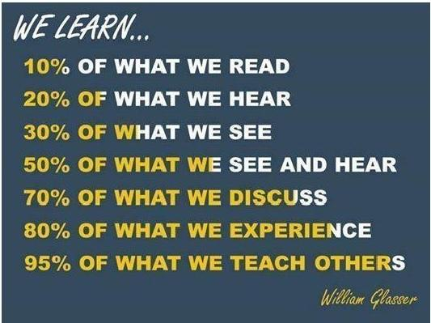

# Lecture #1: Introduction

_September 19 2022_

## Frequently Asked Questions

### Who are you?

My name is Matej Mojzeš and I will be your lecturer, I also:

* Have a Ph.D. in integer optimization heuristics at the Department of Software Engineering, FNSPE CTU in Prague
* Lead a Data Science team in Open Bean
* Possess several years of experience in Business Intelligence, Data Warehousing, Engineering, and Data Science in both start-up and enterprise environments

Feel free to see more on my [LinkedIn profile](https://www.linkedin.com/in/matejmojzes) and add me to your network.

### What is this course about?

Selected aspects of [Business Intelligence](https://en.wikipedia.org/wiki/Business_intelligence), [Decision Support Systems](https://en.wikipedia.org/wiki/Decision_support_system), and [Big Data](https://en.wikipedia.org/wiki/Big_data), including, but not limited to:

* how to move collections of data from one place, format, and source to another (i.e. [ETL](https://en.wikipedia.org/wiki/Extract,_transform,_load), data pumps, etc.),
* how to store data in a way that allows for their quick analysis ([OLAP](https://en.wikipedia.org/wiki/Online_analytical_processing), and other types of analytical databases),
* what is reporting and how to practically approach it,
* how to efficiently perform ad-hoc data analysis, and 
* mine knowledge out of raw data.

We will talk about best practices in how this is done on enterprise level, and try it out using open-source tools, which can be useful in your everyday tasks immediately.

### What prerequisite skills are recommended?

* Probably the most important is **SQL**
* For research, data analysis and engineering: **Python**

Note: We will learn a bit about them throughout the semester. Also, ~~Microsoft SQL Server Enterprise scholar license should be available for our students, if interested~~ -> [not true](https://it.fjfi.cvut.cz/sw) any more, unfortunately:

> [...] Další licence spravují jednotlivé katedry, které produkt zakoupily. Microsoft Imagine, dříve DreamSpark, ještě předtím MSDN AA :-) již není k dispozici [...]

### Why do you teach it?

1. Because I believe that the work in Business Intelligence and Data Science environments is one of the best things that could have happened to me, as a graduate of FNSPE. 
2. Also because I usually learn the most by preparing and giving talks to other people. **I suggest you do the same**, hence the answer to the next question.

### How can I get the _zápočet_?

By:
* actively attending the classes (I may test you with a quick assessment here and there), 
* discussing and working on your project (I will support you as much as I can),
* presenting your results to your classmates.

Nota bene, how it will look like:

### More questions?

Let me answer your questions right away. Should you forget, please post the question directly in the repository, eg. using a [pull request](https://help.github.com/articles/about-pull-requests/).

## So what do we do today?

**Let's talk**! I would like to understand your motivation, experience, what exactly you are interested in. It will help me to personalize the course.
